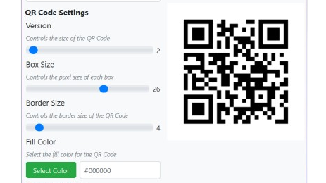

# 🚀 QRCodeGenerator



> A sleek, customizable QR code generator built with PySide6. Instantly create, preview, and save QR codes with a beautiful UI.

---

## 📸 Preview

<!-- Replace the path or URL below with your actual image path if needed -->
<p align="center">
  
  
</p>


---

## 📦 Features

- 🎨 **Customizable QR Codes** – Modify version, box size, border, fill color, and background color.
- ⚡ **Real-time Preview** – QR codes update instantly with your settings.
- 💾 **Save as PNG** – Export QR codes directly to image files.
- 🧑‍💻 **User-friendly Interface** – Clean and modern design styled with QSS.
- 🛠️ **Cross-platform** – Works on Windows, macOS, and Linux.

---

## 🧠 Project Structure

```plaintext
QRCodeGenerator/
├── prj_img/
│   ├── qr_code_generator.png
│   └── version/
│       └── #images
├── resources/
│   ├── config.ini
│   ├── icons/
│   │   └── qrcode_icon.ico
│   └── styles/
│       └── style.qss
├── src/
│   ├── __init__.py
│   ├── app_logic/
│   │   ├── __init__.py
│   │   ├── logger.py
│   │   ├── config.py
│   │   ├── qrcode_logic.py
│   │   └── update_logic.py
│   └── app_ui/
│       ├── __init__.py
│       ├── ui_qrcode.py
│       └── ui_update_window.py
├── app.log
├── main.py
├── Jenkinsfile
├── requirements.txt
├── README.md
└── LICENSE
```

## Installation

1. **Clone the repository**:

   ```bash
   git clone https://github.com/pyapril15/QRCodeGenerator.git
   cd QRCodeGenerator
   ```

2. **Create and activate a virtual environment**:

   ```bash
   python -m venv venv
   venv\Scripts\activate  # On Windows
   source venv/bin/activate  # On macOS/Linux
   ```

3. **Install the required packages**:

   ```bash
   pip install -r requirements.txt
   ```

4. **Run the application**:

   ```bash
   python main.py
   ```

## Usage

1. **Enter text**: Type the text you want to encode.
2. **Customize settings**: Adjust QR code settings using sliders and color pickers.
3. **Generate QR Code**: Click "Generate QR Code" to preview.
4. **Save QR Code**: Click "Save QR Code" to store the image in `saved_qrcodes`.

## Configuration

The `config.ini` file stores default settings:

### `[Settings]`
- `DEFAULT_VERSION = 1`
- `DEFAULT_BOX_SIZE = 10`
- `DEFAULT_BORDER_SIZE = 4`
- `DEFAULT_FILL_COLOR = black`
- `DEFAULT_BACK_COLOR = white`

### `[Paths]`
- `QSS_PATH = resources/styles/style.qss`
- `ICON_PATH = resources/icons/qrcode_icon.ico`

## Logging

The application logs events and errors to `app.log`, aiding in debugging and maintenance.

## Dependency Notes

Some dependencies included during packaging (e.g., `posix`, `pwd`, `grp`) are related to Unix-like systems. They do not affect core functionality on Windows.

## Contributing

Contributions are welcome! Feel free to open an issue or submit a pull request.

## License

This project is licensed under the MIT License. See `LICENSE` for details.

## Contact

**Author:** codelabpraveen  
**Email:** praveen885127@gmail.com
