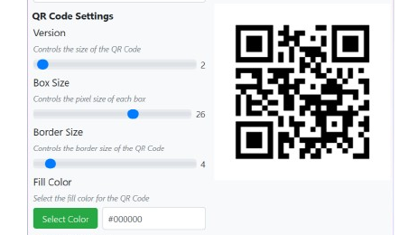

# 🚀 QR Code Generator v1.0.3 - Enhanced Auto-Updater & Performance Improvements

## 🔹 What's New in v1.0.3?  

### ✅ Enhanced Auto-Updater  
- Improved update window UI with real-time progress updates.  
- Automatically deletes the previous `.exe` after a successful update.  
- Notifies the user before restarting the application.  

  
  

### ✅ Performance & Stability Improvements  
- Optimized threading for better responsiveness during updates.  
- Reduced unnecessary disk writes and improved logging efficiency.  

### ✅ Bug Fixes  
- Fixed issue where update progress was not displayed correctly.  
- Resolved minor UI glitches in the update window.  

---

## 📥 Download & Install  

👉 **[Download QRCodeGenerator.exe](https://github.com/pyapril15/QRCodeGenerator/releases/download/v1.0.3/QRCodeGenerator.exe)**  
Simply run the `.exe` to start generating QR codes instantly!

---

## 📌 Notes  

If you're upgrading from an older version:  
No manual steps needed—just download and run the new `.exe`.

---

## 🔗 Resources  

- 💻 **[View Source Code on GitHub](https://github.com/pyapril15/QRCodeGenerator)**
